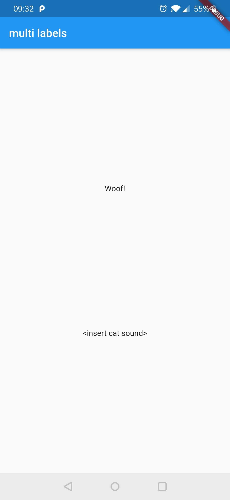
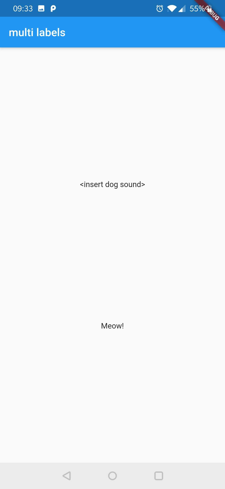

# multi_labels

A Flutter project to test multiple `LocalizationsDelegate`s.

## Used commands

1. Extract labels of both cats and dogs

`flutter pub run intl_translation:extract_to_arb --output-dir=lib/cat_labels/gen lib/cat_labels/CatLabels.dart`

`flutter pub run intl_translation:extract_to_arb --output-dir=lib/dog_labels/gen lib/dog_labels/DogLabels.dart`

2. Translate the generated `intl_messages.arb` to have two language files
- intl_en.arb
- intl_nl.arb

3. Generate the dart files from ARB

`flutter pub run intl_translation:generate_from_arb --output-dir=lib/cat_labels lib/cat_labels/CatLabels.dart lib/cat_labels/gen/intl_*.arb`

`flutter pub run intl_translation:generate_from_arb --output-dir=lib/dog_labels lib/dog_labels/DogLabels.dart lib/dog_labels/gen/intl_*.arb`

## Issue

We define multiple `localizationsDelegate`s in the `MaterialApp` widget.

```
// main.dart > MaterialApp

localizationsDelegates: [
    DogLocalizationsDelegate(),
    CatLocalizationsDelegate(),
    GlobalMaterialLocalizations.delegate,
    GlobalWidgetsLocalizations.delegate,
    GlobalCupertinoLocalizations.delegate,
],
```

If we want to use labels of both delegates, only the translated labels of the first specified delegate be used. For the labels of the next delegate, the default text defined in the localizations file, will be used.

In this demo project, having the following order of delegates:
```
// main.dart (line 20)
DogLocalizationsDelegate(),
CatLocalizationsDelegate(),
```
will give you the following result:


When **switching** it:
```
// main.dart (line 20)
CatLocalizationsDelegate(),
DogLocalizationsDelegate(),
```
this will be the result:
